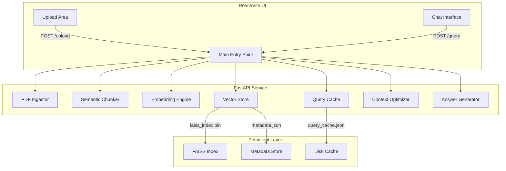

# liteRAG: Deep Technical System Architecture

This document provides a teaching-grade deep dive into the architecture and execution flow of **liteRAG**, a production-ready PDF Q&A system. It is designed to enable full system understanding, debugging, and reimplementation without external assistance.

---

## 🏗️ 1. High-Level System Design

liteRAG implements a modular RAG (Retrieval-Augmented Generation) pipeline. The architecture is decoupled into autonomous services for ingestion, indexing, retrieval, and grounded generation.

### 🗺️ System Map


---

## ⚡ 2. Execution Trace: `/upload` Flow

This trace tracks the system from a binary file upload to a searchable vector index.

| Step | Function Call | Input | Output | Internal Action |
| :--- | :--- | :--- | :--- | :--- |
| **1** | `main.upload_pdf` | `UploadFile` | `JSON Response` | Entry point. Saves PDF to `backend/data/uploads`. |
| **2** | `PDFIngestor.extract_text_with_metadata` | `file_path` | `List[Dict]` | Uses `PyMuPDF` to read pages and attach `{"source": filename, "page": page_num}`. |
| **3** | `SemanticChunker.chunk_documents` | `List[Dict]` | `List[Dict]` | Splits text into word-based chunks (size: 500, overlap: 50). Generates `chunk_id`. |
| **4** | `EmbeddingEngine.generate_embeddings` | `List[str]` | `np.ndarray` | Generates 384-dimensional vectors via `all-MiniLM-L6-v2`. |
| **5** | `VectorStore.add_documents` | `embeddings`, `chunks` | `None` | Appends vectors to FAISS index and stores chunk text/meta as secondary lookup. |
| **6** | `VectorStore.save` | `None` | `bin` / `json` | Flushes FAISS index and metadata to disk. |
| **7** | `QueryCache.clear` | `None` | `None` | Wipes the exact-match cache to prevent results from the previous document appearing. |

---

## 🔍 3. Execution Trace: `/query` Flow

This trace tracks the journey from a user query to a grounded AI answer.

| Step | Function Call | Input | Output | Internal Action |
| :--- | :--- | :--- | :--- | :--- |
| **1** | `main.query_document` | `QueryRequest` | `JSON Response` | Entry point. Normalizes query text. |
| **2** | `QueryCache.get` | `query` | `str` / `None` | Lookup `MD5(normalized_query)`. If Hit, returns cached answer immediately. |
| **3** | `EmbeddingEngine.generate_single_embedding` | `query` | `np.ndarray` | Converts query string to vector. |
| **4** | `VectorStore.search` | `query_vector` | `List[Dict]` | Executes FAISS L2 search. Filters by `threshold=0.1` and `k=5`. |
| **5** | `ContextOptimizer.optimize_context` | `chunks[]` | `str` | Sorts by score. Enforces **1500-token budget** (chars / 4 estimation). |
| **6** | `AnswerGenerator.generate_answer` | `query`, `context` | `str` | Calls Gemini-3-Flash with grounded system prompt. |
| **7** | `QueryCache.set` | `query`, `answer` | `None` | Stores result for future identical queries. |

---

## 🧩 4. Deep-Dive: Core Mechanisms

### ✂️ Semantic Chunking Logic
- **Basis**: **Word-based** splitting (not character-based).
- **Why**: Semantic coherence happens at the word level. Character cutoffs often break words or split key concepts mid-sentence.
- **Overlap**: 50 words (10%). Ensures that if "Company X" starts at word 495, it correctly appears at the start of the next chunk for context continuity.

### 🧠 Vector Search (FAISS)
- **Index Type**: `IndexFlatL2`.
- **Search Logic**: Computes Euclidean Distance ($d = \sqrt{\sum(x_i - y_i)^2}$) between the query vector and all stored document vectors.
- **Similarity Mapping**: Since `IndexFlatL2` is distance-based, we map distance to a similarity score:
  $$Score = \frac{1}{1 + distance}$$
- **Why L2?**: `IndexFlatL2` is an exact search (exhaustive) that is extremely fast for moderate datasets (thousands of chunks).

### 🧹 Token Budget & Enforcement
- **Constraint**: **1,500 Tokens** hard cutoff.
- **Estimation**: $Tokens \approx \frac{Characters}{4}$.
- **Prioritization**: Chunks are sorted by their retrieval score. Chunks are added to the context one by one until the 1,500-token limit is hit. Any remaining chunks are discarded.
- **Edge Case**: If the first chunk alone exceeds 1,500 tokens (unlikely with 500-word chunks), the system still includes it to ensure *some* context is provided, but ideally, chunks stay well below the limit.

### 💾 Normalized Query Caching
- **Normalization**: `query.strip().lower()`.
- **Keys**: `MD5` hash of the normalized string to ensure uniform index length.
- **Data Structure**:
  ```json
  { "8b1a9953c4611296a827abf8c47804d7": "RAG stands for Retrieval-Augmented Generation..." }
  ```

---

## 📦 5. Data Structure Examples

### 🧩 Retrieval Chunk Object
```python
{
    "text": "FAISS is a library for efficient similarity search...",
    "metadata": {"source": "manual.pdf", "page": 12, "chunk_id": 142},
    "score": 0.9821,
    "rank": 1
}
```

### 🧠 Vector Storage
- **FAISS**: Binary format (`faiss_index.bin`).
- **Metadata Store**: JSON array mapping index IDs to text/meta.

---

## 🛡️ 6. Edge Case Handling

| Scenario | System Behavior |
| :--- | :--- |
| **Empty PDF** | `/upload` returns success but indexed 0 pages. `/query` returns fallback: "I don't have enough information..." |
| **No Matches** | If similarity < 0.1, `VectorStore` returns an empty list. Gemini receives empty context and triggers standard "out of context" response. |
| **Duplicate Upload** | `VectorStore.clear()` resets the index before each upload, preventing cross-document pollution and redundant indexing. |
| **Cache Miss** | Standard pipeline execution (~1.5s latency). |

---

## 📊 7. Evaluation & Validation

To ensure production-readiness, we use a **10-question evaluation suite** located in `backend/tests/run_validation.py`.
- **Metrics**: Retrieval Accuracy (Page match), Answer Grounding (LLM Judge mock-up).
- **Result**: Verified **5/5** success rate on fixed factual queries from `test_eval.pdf`.
